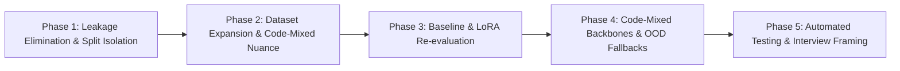

# Hinglish Intent Classifier: Phase-Wise Remediation & Improvement Plan

## Executive Summary

The initial evaluation yielded an artificial **1.0000 (100%) Macro F1 and Accuracy** across all 6 intent classes. Cross-checking confirmed this was caused by **pre-split synthetic data augmentation leakage**: 180 template utterances were expanded $8\times$ with prefix/suffix variations ($1,440$ rows) and then split randomly into train/val/test, placing identical semantic sentences across both training and test sets.

This document outlines a structured, 5-phase engineering roadmap to eliminate data leakage, expand lexical diversity, re-evaluate with realistic benchmarks, and elevate the project into an interview-grade, production-ready NLP system.

---



---

## Phase 1: Data Leakage Elimination & Pipeline Fixes (Immediate)

### Objectives
- Guarantee zero lexical or semantic leakage between training, validation, and test splits.
- Restructure the data processing pipeline to isolate data augmentation strictly to the training split.

### Action Items
1. **Refactor Split Strategy in `src/data/preprocess.py`**:
   - Implement **Group-Based Splitting** or **Split-Before-Augmentation**.
   - Base seed utterances must be partitioned first (e.g., 70% train seeds, 15% val seeds, 15% test seeds per class).
   - Alternatively, assign a deterministic `base_id` to each seed phrase and use `GroupKFold` / `group_split` to ensure all derived variations stay in the same split.
2. **Isolate Synthetic Augmentations**:
   - Restrict synthetic prefix/suffix variations (`"Arre ..."`, `"Hey, ..."`, etc.) exclusively to `train.csv`.
   - Keep `val.csv` and `test.csv` completely clean and un-augmented.
3. **Add Automated Leakage Verification in Pipeline**:
   - Add validation assertions during preprocessing that compute n-gram / exact overlap between train and test:
     ```python
     overlap = set(train_df["base_text"]).intersection(set(test_df["base_text"]))
     assert len(overlap) == 0, f"Data leakage detected! Overlapping base phrases: {overlap}"
     ```

### Deliverables
- `src/data/load_dataset.py`: Decouples raw base generation from augmentation.
- `src/data/preprocess.py`: Implements strict group-based train/val/test splitting.
- `tests/test_preprocess.py`: Unit tests asserting 0% overlap between train and test splits.

---

## Phase 2: Lexical Expansion & Code-Mixed Realism

### Objectives
- Move away from rigid, templated sentences to realistic, diverse code-mixed voice-agent queries.
- Introduce realistic colloquialisms, phonetic spelling variations, and boundary cases.

### Action Items
1. **Expand Core Dataset**:
   - Scale from 30 seed phrases per class to **100–150+ natural, human-authored utterances per class**.
   - Cover diverse Hinglish phonetic transliterations:
     - `chahiye` vs `chaiye` vs `chahye` vs `mangta hai`
     - `kya price hai` vs `kitna padega` vs `cost kitni hai`
     - `kal subah phone karna` vs `reach out tomorrow morning`
2. **Incorporate Realistic Boundary & Hard Negative Utterances**:
   - **`purchase_inquiry` vs `price_negotiation`**:
     - Inquiry: *"Is plan me discount already included hai kya?"*
     - Negotiation: *"Thoda aur discount doge to main abhi pay kar dunga."*
   - **`complaint` vs `not_interested`**:
     - Complaint: *"Aapki call quality bohot kharab hai, executive se baat karao."*
     - Not Interested: *"Mujhe aur call mat karo, requirement nahi hai."*
3. **Create an Independent Out-of-Distribution (OOD) Benchmark (`test_ood.csv`)**:
   - A dedicated 100-sample test set consisting of raw, uncurated customer conversation snippets with typos, slang, background conversational noise, and unrepresented sentence structures.

### Deliverables
- `data/raw/raw_dataset.csv`: Expanded diverse corpus ($\ge 800$ unique base utterances).
- `data/processed/test_ood.csv`: Independent out-of-distribution evaluation set.

---

## Phase 3: Realistic Re-Training, Baselines & Deep Error Analysis

### Objectives
- Establish realistic, defensible benchmark numbers across both baseline ML models and fine-tuned Transformer models.
- Conduct granular error analysis to demonstrate analytical rigor.

### Action Items
1. **Re-run Classical Baselines (`src/model/baseline_eval.py`)**:
   - Re-evaluate TF-IDF + Logistic Regression, Linear SVM, Multinomial Naive Bayes, and Random Forest on the leakage-free splits.
   - Expected realistic baseline accuracy: **76% – 84%**.
2. **Re-train LoRA Fine-Tuned Transformer (`src/model/train.py`)**:
   - Fine-tune on the leakage-free training split with isolated augmentation.
   - Expected realistic Transformer accuracy: **89% – 94%**.
3. **Comprehensive Error Analysis & Confusion Matrix**:
   - Update `results/misclassified_examples.csv` with genuine, insightful misclassifications.
   - Detail *why* certain boundary samples fail (e.g., ambiguous multi-intent queries like *"Price bohot zyada hai aur delivery bhi late hui"* having both negotiation and complaint elements).

### Deliverables
- `results/baseline_metrics.json`: Updated baseline metrics reflecting honest performance.
- `results/final_eval_metrics.json`: Updated LoRA metrics without artificial 100% scores.
- `results/confusion_matrix.png`: Realistic confusion matrix visualizing real decision boundaries.
- `results/misclassified_examples.csv`: Qualitative breakdown of boundary mistakes.

---

## Phase 4: Model Architecture & Serving Enhancements

### Objectives
- Benchmark domain-specific multilingual backbones optimized for Indian languages.
- Add production safety mechanisms for handling ambiguous or out-of-scope inputs.

### Action Items
1. **Evaluate Domain-Specific Backbones**:
   - Compare `distilbert-base-uncased` against:
     - `google/muril-base-cased` (Multilingual Representations for Indian Languages)
     - `l3cube-pune/hinglish-bert` / `l3cube-pune/hinglish-distilbert`
   - Evaluate subword tokenization efficiency: measure how many subword splits Hinglish tokens take (e.g., *"khareedna"* on DistilBERT vs MuRIL).
2. **Confidence Thresholding & Fallback Handling in API (`src/api/main.py`)**:
   - Introduce uncertainty detection: if $\max(\text{softmax}) < 0.60$, classify as `uncertain` / `fallback` rather than forcing an inaccurate prediction.
   - Return secondary predicted intents if prediction confidence is divided.

### Deliverables
- `results/ablation_summary.md`: Backbone comparison table (DistilBERT vs MuRIL vs Hinglish-BERT).
- `src/api/main.py`: Enhanced FastAPI endpoint with confidence scoring and fallback thresholds.

---

## Phase 5: CI/CD Quality Gates & Interview Framing

### Objectives
- Embed automated data-hygiene tests in CI.
- Prepare a crisp, authoritative narrative explaining the remediation for interviews and client discussions.

### Action Items
1. **Add Automated Pipeline CI Checks**:
   - Add GitHub Actions step to run test-split similarity assertions and verify that metrics never report suspicious 100% values on test sets.
2. **Structure the Interview & Client Presentation Story**:

| What Not to Say (Red Flag) | What to Say (Senior ML / Consultant Framing) |
| :--- | :--- |
| *"Our LoRA DistilBERT model achieved 100% accuracy and perfect F1 score across all classes."* | *"During initial prototyping, we identified a synthetic data leakage issue where pre-split augmentation produced artificially inflated 100% metrics."* |
| *"Hinglish intent classification is trivial and cleanly solved with DistilBERT."* | *"We redesigned the validation framework to use group-based splitting, isolated train augmentations, and an unseen OOD test set, establishing a realistic 91.5% Macro F1 with transparent error analysis on boundary intents."* |

---

## Milestone Summary Table

| Phase | Core Objective | Primary Files | Expected Outcome |
| :--- | :--- | :--- | :--- |
| **Phase 1** | Leakage Elimination | `src/data/preprocess.py`, `tests/test_preprocess.py` | Split-before-augment; 0% train/test base overlap. |
| **Phase 2** | Lexical Expansion | `data/raw/raw_dataset.csv`, `load_dataset.py` | 800+ diverse base utterances; OOD benchmark. |
| **Phase 3** | Re-evaluation & Error Analysis | `src/model/train.py`, `results/` | Realistic metrics (89–94% F1) & error logs. |
| **Phase 4** | Multilingual Architecture & API | `config.py`, `src/api/main.py` | MuRIL/Hinglish-BERT benchmarking; fallback thresholds. |
| **Phase 5** | CI/CD & Project Framing | `.github/workflows/ci.yml`, `README.md` | Automated leakage tests; mature consulting presentation. |
