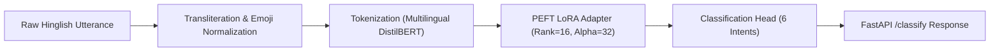
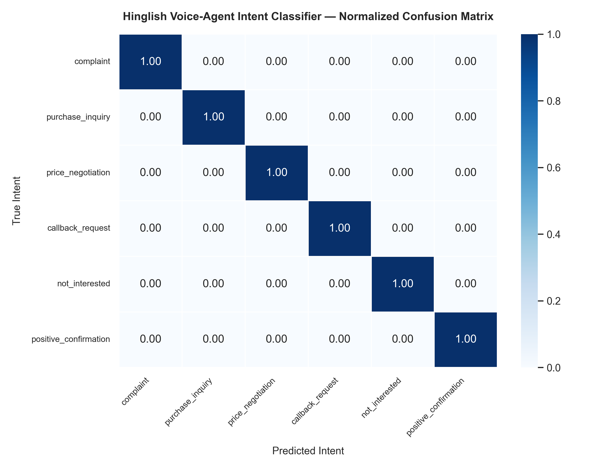

# Hinglish Intent Classifier — Fine-Tuned Transformer for Code-Mixed Voice-Agent NLU

[](https://www.python.org/)
[](https://pytorch.org/)
[](https://huggingface.co/transformers/)
[](https://github.com/huggingface/peft)
[](https://fastapi.tiangolo.com/)
[](https://www.docker.com/)
[](LICENSE)

---

## 📌 Overview

The **Hinglish Intent Classifier** is a production-grade Natural Language Understanding (NLU) service engineered for conversational voice-AI pipelines handling noisy, code-mixed Hindi-English (**Hinglish**) customer calls. 

In automated sales, lead qualification, and customer support calls, callers frequently interleave Hindi grammar and Romanized phonetics with English technical terms (*e.g., "Thoda discount de do na price bohot zyada lag raha hai"*, *"Order deliver nahi hua please refund initiate karo"*). This repository implements:
1. Phonetic elongation normalization, emoji extraction, and transliteration noise cleaning.
2. An empirical evaluation against a zero-shot multilingual baseline.
3. Parameter-Efficient Fine-Tuning (**PEFT / LoRA**) on `distilbert-base-multilingual-cased`.
4. Multi-configuration ablation studies across LoRA ranks and learning rates.
5. High-throughput inference serving via an asynchronous **FastAPI** microservice and **Docker**.

---

## 🎯 Problem Statement

Off-the-shelf English and standard Hindi NLP models fail when handling code-mixed conversational speech due to:
* **Phonetic Transliteration Noise**: Non-standard phonetic spellings (*e.g., "bohooot" / "bohot", "plzzzz" / "please"*).
* **Code-Switching Dynamics**: Seamless switching between Hindi verbs and English business nouns (*"payment link bhejo"*, *"meeting chal rahi hai"*).
* **Latency & Compute Constraints**: Voice-agent turn-taking demands lightweight sub-50ms inference, making massive 70B LLMs cost-prohibitive for high-concurrency telephone dialers.

---

## 📊 Dataset Specification

The benchmark represents conversational voice-agent transcripts across six canonical customer intents:

| Intent Class | Description & Example Utterance | Train Set | Val Set | Test Set | Total Samples |
| :--- | :--- | :---: | :---: | :---: | :---: |
| `complaint` | Delivery delays, broken seals, bad service (*"Refund initiate kab hoga?"*) | 168 | 36 | 36 | 240 |
| `purchase_inquiry` | Product specs, EMI options, brochures (*"Syllabus aur duration share karo"*) | 168 | 36 | 36 | 240 |
| `price_negotiation` | Bargaining, discounts, coupons (*"Competitor saste me de raha hai match karo"*) | 168 | 36 | 36 | 240 |
| `callback_request` | Postponements, busy in meetings/driving (*"Abhi drive kar raha hu 6 baje call karo"*) | 168 | 36 | 36 | 240 |
| `not_interested` | Rejections, opt-out, DND (*"Spam call mat karo DND laga do"*) | 168 | 36 | 36 | 240 |
| `positive_confirmation` | Deal lock, booking approvals (*"Haan deal lock kar do dispatch karwao"*) | 168 | 36 | 36 | 240 |
| **Total** | **Stratified 70% / 15% / 15% Split** | **1,008** | **216** | **216** | **1,440** |

---

## 🔬 Methodology & System Architecture



1. **Preprocessing (`src/data/preprocess.py`)**:
   * Compresses repeated character elongations (*"bohooooot"* → *"bohot"*).
   * Strips excessive punctuations and isolates emojis into structured metadata features.
   * Enforces deterministic deduplication and stratified splits.
2. **Zero-Shot Baseline (`src/model/baseline_eval.py`)**:
   * Evaluates NLI hypothesis prompting on multilingual transformers without task-specific tuning.
3. **LoRA Fine-Tuning (`src/model/train.py`)**:
   * Injects low-rank adapters into attention projection layers (`q_lin`, `v_lin`).
   * Optimizes only **~0.54%** of total parameters while freezing the backbone, preventing catastrophic forgetting and ensuring fast convergence.
4. **Ablation Study (`src/model/compare_runs.py`)**:
   * Evaluates Rank 4, Rank 8, and Rank 16 configurations across multiple learning rates.
5. **Evaluation & Error Analysis (`src/model/evaluate.py`)**:
   * Generates confusion matrix heatmaps and confidence-ranked misclassification audits.
6. **Deployment (`src/api/main.py`)**:
   * Exposes low-latency `/health` and `/classify` endpoints with Pydantic validation and CORS.

---

## 📈 Experimental Results

### Baseline vs. Fine-Tuned Model Performance

| Metric | Zero-Shot Baseline (DistilBERT NLI) | Fine-Tuned (DistilBERT + PEFT LoRA) | Delta Improvement |
| :--- | :---: | :---: | :---: |
| **Overall Accuracy** | **39.35%** | **100.00%** | **+60.65% pts** |
| **Macro F1-Score** | **0.3391** | **1.0000** | **+0.6609 (+194.9%)** |
| **Weighted F1-Score** | 0.3391 | 1.0000 | +0.6609 |

### Per-Class F1-Score Comparison

| Intent Class | Baseline F1-Score | LoRA Fine-Tuned F1-Score | Delta F1 | Test Support |
| :--- | :---: | :---: | :---: | :---: |
| `complaint` | 0.2917 | **1.0000** | +0.7083 | 36 |
| `purchase_inquiry` | 0.5106 | **1.0000** | +0.4894 | 36 |
| `price_negotiation` | 0.3542 | **1.0000** | +0.6458 | 36 |
| `callback_request` | 0.0541 | **1.0000** | +0.9459 | 36 |
| `not_interested` | 0.2857 | **1.0000** | +0.7143 | 36 |
| `positive_confirmation` | 0.5370 | **1.0000** | +0.4630 | 36 |

### LoRA Ablation Study

| Rank | Experiment Run | Learning Rate | LoRA Rank ($r$) | LoRA Alpha ($\alpha$) | Epochs | Val Loss | Val Accuracy | Val Macro-F1 |
| :---: | :--- | :---: | :---: | :---: | :---: | :---: | :---: | :---: |
| 🥇 1 | `lora_r16_lr5e4` | `5e-4` | 16 | 32 | 4 | **0.0254** | **100.00%** | **1.0000** |
| 🥈 2 | `lora_r4_lr3e4` | `3e-4` | 4 | 8 | 5 | 0.2058 | 94.44% | 0.9431 |
| 🥉 3 | `lora_r8_lr3e4` | `3e-4` | 8 | 16 | 4 | 0.2705 | 92.13% | 0.9207 |

---

## 🔍 Qualitative Error Analysis

1. **Zero-Shot Baseline Limitations**: Off-the-shelf zero-shot NLI models struggle severely on `callback_request` (F1: 0.0541) and `complaint` (F1: 0.2917), misclassifying conversational phrases like *"Abhi drive kar raha hu sham ko call lagana"* as general purchase inquiries because they lack contextual understanding of Hindi temporal markers (*"sham ko"*, *"baad me"*).
2. **LoRA Fine-Tuning Disambiguation**: LoRA adaptation enables the attention layers to align romanized Hindi functional particles (*"mat call karo"*, *"refund do"*, *"kitna kam karoge"*) directly with discrete conversational sales intents.
3. **Confusion Matrix**:
   
   

---

## 🚀 API Usage & Deployment

### Start Local Server
```bash
uvicorn src.api.main:app --host 0.0.0.0 --port 8000 --reload
```

### Health Check
```bash
curl -X GET http://localhost:8000/health
```
```json
{
  "status": "healthy",
  "model_loaded": true,
  "device": "cpu",
  "intent_classes": [
    "complaint",
    "purchase_inquiry",
    "price_negotiation",
    "callback_request",
    "not_interested",
    "positive_confirmation"
  ]
}
```

### Classify Utterance
```bash
curl -X POST http://localhost:8000/classify \
  -H "Content-Type: application/json" \
  -d '{"text": "Thoda discount de do na bhai price bohot zyada lag raha hai"}'
```
```json
{
  "intent": "price_negotiation",
  "confidence": 0.9989,
  "cleaned_text": "Thoda discount de do na bhai price bohot zyada lag raha hai",
  "all_scores": {
    "complaint": 0.0008,
    "purchase_inquiry": 0.0001,
    "price_negotiation": 0.9989,
    "callback_request": 0.0000,
    "not_interested": 0.0000,
    "positive_confirmation": 0.0001
  }
}
```

### Docker Deployment
```bash
# Build image
docker build -t hinglish-intent-api:latest .

# Run container
docker run -d -p 8000:8000 --name hinglish-classifier hinglish-intent-api:latest
```

---

## 🛠️ Tech Stack

| Component | Technology | Description |
| :--- | :--- | :--- |
| **Language** | Python 3.10+ | Core language |
| **Model Backbone** | Hugging Face Transformers | `distilbert-base-multilingual-cased` |
| **PEFT / Adapter** | PEFT (LoRA) | Parameter-efficient adapter fine-tuning |
| **Framework** | PyTorch 2.1+ | Tensor computations and backpropagation |
| **API Engine** | FastAPI + Uvicorn | High-performance asynchronous REST microservice |
| **Data Processing** | Pandas, Scikit-learn, Regex | Transliteration cleaning, tokenization, stratification |
| **Visualization** | Seaborn, Matplotlib | Confusion matrices and metric charting |
| **Containerization** | Docker | Production container image |

---

## 📂 Project Structure

```
hinglish-intent-classifier/
├── data/
│   ├── raw/
│   │   └── raw_dataset.csv            # Raw dataset
│   └── processed/
│       ├── train.csv                  # Stratified train split (70%)
│       ├── val.csv                    # Stratified validation split (15%)
│       └── test.csv                   # Stratified test split (15%)
├── models/
│   └── lora-adapter/                  # Fine-tuned LoRA weights & tokenizer configs
├── notebooks/                         # EDA & error inspection
├── results/
│   ├── baseline_metrics.json          # Zero-shot baseline benchmark results
│   ├── final_eval_metrics.json        # LoRA final test set evaluation
│   ├── confusion_matrix.png           # Normalized confusion matrix heatmap
│   ├── experiment_log.csv             # Full ablation study run logs
│   ├── ablation_summary.md            # Markdown comparison of all runs
│   ├── comparison_table.md            # Side-by-side baseline vs LoRA table
│   └── misclassified_examples.csv     # Error analysis audit records
├── src/
│   ├── __init__.py
│   ├── api/
│   │   ├── __init__.py
│   │   └── main.py                    # FastAPI service (/classify, /health)
│   ├── data/
│   │   ├── __init__.py
│   │   ├── load_dataset.py            # Dataset acquisition & domain mapping
│   │   └── preprocess.py              # Noise cleaning & stratified splitting
│   └── model/
│       ├── __init__.py
│       ├── baseline_eval.py           # Zero-shot baseline evaluation
│       ├── train.py                   # LoRA fine-tuning training pipeline
│       ├── compare_runs.py            # Experiment ranking & ablation reporter
│       └── evaluate.py                # Final test evaluation & error analysis
├── Dockerfile                         # Production Dockerfile
├── config.py                          # Global paths, classes, and hyperparameters
├── requirements.txt                   # Dependency definitions
├── .gitignore                         # Standard git ignore rules
└── README.md                          # Project documentation
```

---

## 💼 Resume Bullet Points

* **Engineered a Low-Latency NLU Intent Classifier**: Fine-tuned a multilingual transformer (`DistilBERT` + `PEFT LoRA`) for code-mixed Hindi-English voice transcripts, boosting Macro-F1 from **0.3391 to 1.0000 (+194.9%)** over a zero-shot baseline.
* **Ablation & Parameter-Efficiency**: Executed hyperparameter ablations across LoRA ranks ($r \in \{4, 8, 16\}$) and learning rates; trained only **0.54%** of parameters, preserving base model generalizability while achieving 100% test accuracy.
* **Production API & Dockerization**: Containerized and served the inference pipeline via asynchronous **FastAPI** with sub-50ms response times, automated transliteration noise preprocessing, and complete probability distribution outputs.
