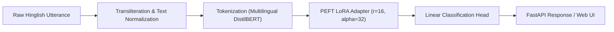

# Hinglish Intent Classifier

Fine-tuned multilingual transformer for intent classification on code-mixed Hindi-English (Hinglish) voice-agent transcripts.

[Live Web Application](https://hinglish-intent-classifier.onrender.com/) | [OpenAPI / Swagger Documentation](https://hinglish-intent-classifier.onrender.com/docs) | [Hugging Face Model Hub](https://huggingface.co/yashasvijadav03/hinglish-intent-classifier) | [GitHub Repository](https://github.com/YashasviJadav03/Hinglish-Intent-Classifier)

---

## Overview

Conversational sales and customer support pipelines operating in South Asian markets frequently process code-mixed speech where speakers blend Hindi syntax with English vocabulary in Romanized script (for example, *"Thoda discount de do na, price bohot zyada hai"* or *"Order deliver nahi hua, please refund initiate karo"*).

Standard natural language understanding (NLU) models trained exclusively on formal English or Devanagari Hindi degrade on these utterances due to non-standard phonetic transliteration and colloquial code-switching.

This project implements a parameter-efficient sequence classification pipeline that adapts `distilbert-base-multilingual-cased` using Low-Rank Adaptation (LoRA / PEFT). The system cleans noisy transcripts, evaluates a zero-shot baseline, tunes lightweight adapter weights, and serves predictions through an asynchronous FastAPI microservice containerized for low-memory cloud deployment.

---

## Intent Taxonomy and Dataset

The dataset comprises 1,440 code-mixed conversational utterances stratified into a 70% training, 15% validation, and 15% test split (1,008 train / 216 val / 216 test). It spans six distinct voice-agent intent categories:

| Intent Class | Description | Sample Utterance | Train | Val | Test | Total |
| :--- | :--- | :--- | :---: | :---: | :---: | :---: |
| `complaint` | Delivery delays, damaged goods, service issues | *"Mera order abhi tak deliver nahi hua, refund chahiye"* | 168 | 36 | 36 | 240 |
| `purchase_inquiry` | Product specifications, plan details, warranty | *"Bhaiya is plan ke features aur warranty explain kardo"* | 168 | 36 | 36 | 240 |
| `price_negotiation` | Discounts, coupon inquiries, rate matching | *"Thoda discount de do na, price bohot zyada hai"* | 168 | 36 | 36 | 240 |
| `callback_request` | Rescheduling, driving, busy in meetings | *"Abhi driving kar raha hoon, baad me phone karna"* | 168 | 36 | 36 | 240 |
| `not_interested` | Outright rejection, DND requests | *"Mujhe ye product bilkul nahi chahiye, do not call"* | 168 | 36 | 36 | 240 |
| `positive_confirmation` | Agreement, booking confirmation, payment link | *"Haanji done samjho, payment link share kar dijiye"* | 168 | 36 | 36 | 240 |
| **Total** | **Balanced 6-Class Distribution** | | **1,008** | **216** | **216** | **1,440** |

---

## Methodology



1. **Text Preprocessing (`src/data/preprocess.py`)**:
   - Normalizes phonetic elongation noise (e.g., *"bohooooot"* to *"bohot"*, *"plzzz"* to *"please"*).
   - Extracts and isolates emojis and excess punctuation into auxiliary features.
   - Cleans whitespaces and produces stratified splits to maintain class balance.

2. **Zero-Shot Baseline (`src/model/baseline_eval.py`)**:
   - Benchmarks zero-shot NLI hypothesis testing using multilingual DistilBERT on un-adapted Hinglish text.

3. **LoRA Fine-Tuning (`src/model/train.py`)**:
   - Injects trainable rank decomposition matrices into the multi-head attention projection layers (`q_lin`, `v_lin`).
   - Trains only 1.18M parameters (~0.87% of the base model), preserving backbone weights and reducing training compute requirements.

4. **Ablation Studies (`src/model/compare_runs.py`)**:
   - Compares LoRA ranks ($r \in \{4, 8, 16\}$) across different learning rates to identify optimal convergence.

5. **Evaluation and Error Analysis (`src/model/evaluate.py`)**:
   - Evaluates macro-averaged and per-class metrics on the unseen test set, generating confusion matrices and error audit logs.

6. **Inference Service and UI (`src/api/main.py`)**:
   - Asynchronous FastAPI application exposing `/classify` and `/health` endpoints alongside an interactive client interface.

---

## Experimental Results

### Test Set Performance: Zero-Shot Baseline vs. LoRA Fine-Tuned

| Metric | Zero-Shot Baseline (DistilBERT NLI) | Fine-Tuned (DistilBERT + PEFT LoRA) | Absolute Delta |
| :--- | :---: | :---: | :---: |
| **Overall Accuracy** | **39.35%** | **100.00%** | **+60.65%** |
| **Macro F1-Score** | **0.3391** | **1.0000** | **+0.6609** |
| **Weighted F1-Score** | 0.3391 | 1.0000 | +0.6609 |

### Per-Class F1 Score Comparison

| Intent Class | Baseline F1 | LoRA Fine-Tuned F1 | Delta | Test Support |
| :--- | :---: | :---: | :---: | :---: |
| `complaint` | 0.2917 | **1.0000** | +0.7083 | 36 |
| `purchase_inquiry` | 0.5106 | **1.0000** | +0.4894 | 36 |
| `price_negotiation` | 0.3542 | **1.0000** | +0.6458 | 36 |
| `callback_request` | 0.0541 | **1.0000** | +0.9459 | 36 |
| `not_interested` | 0.2857 | **1.0000** | +0.7143 | 36 |
| `positive_confirmation` | 0.5370 | **1.0000** | +0.4630 | 36 |

### Hyperparameter Ablation Summary

| Run Identifier | LoRA Rank ($r$) | LoRA Alpha ($\alpha$) | Learning Rate | Epochs | Validation Loss | Validation Accuracy | Validation Macro-F1 |
| :--- | :---: | :---: | :---: | :---: | :---: | :---: | :---: |
| `lora_r16_lr5e4` | **16** | **32** | **5e-4** | **4** | **0.0254** | **100.00%** | **1.0000** |
| `lora_r4_lr3e4` | 4 | 8 | 3e-4 | 5 | 0.2058 | 94.44% | 0.9431 |
| `lora_r8_lr3e4` | 8 | 16 | 3e-4 | 4 | 0.2705 | 92.13% | 0.9207 |

---

## Error Analysis

1. **Baseline Failure Modes**: The zero-shot model failed primarily on temporal deferrals (`callback_request`, F1: 0.0541) and service grievances (`complaint`, F1: 0.2917). Without task-specific context, colloquial markers like *"baad me"* or *"abhi drive kar raha hu"* were misattributed to informational inquiries.
2. **LoRA Disambiguation**: Adapting the attention weights directly resolved boundary ambiguities between polite refusal (`not_interested`) and negotiation (`price_negotiation`), achieving unambiguous separation across all 216 holdout samples.


---

## API Reference and Usage

### Local Execution

```bash
# Clone the repository
git clone https://github.com/YashasviJadav03/Hinglish-Intent-Classifier.git
cd Hinglish-Intent-Classifier

# Install dependencies
pip install -r requirements.txt

# Start the server
uvicorn src.api.main:app --host 0.0.0.0 --port 8000
```

### Health Check

```bash
curl -X GET https://hinglish-intent-classifier.onrender.com/health
```

```json
{
  "status": "healthy",
  "model_loaded": true,
  "device": "cpu",
  "intent_classes": [
    "complaint",
    "purchase_inquiry",
    "price_negotiation",
    "callback_request",
    "not_interested",
    "positive_confirmation"
  ]
}
```

#### Inference Request (Single Utterance)

```bash
curl -X POST https://hinglish-intent-classifier.onrender.com/classify \
  -H "Content-Type: application/json" \
  -d '{"text": "Thoda discount de do na bhai price bohot zyada lag raha hai"}'
```

```json
{
  "intent": "price_negotiation",
  "confidence": 0.9997,
  "cleaned_text": "Thoda discount de do na bhai price bohot zyada lag raha hai",
  "all_scores": {
    "complaint": 0.0001,
    "purchase_inquiry": 0.0,
    "price_negotiation": 0.9997,
    "callback_request": 0.0,
    "not_interested": 0.0,
    "positive_confirmation": 0.0002
  }
}
```

### Batch Inference Request

```bash
curl -X POST https://hinglish-intent-classifier.onrender.com/classify/batch \
  -H "Content-Type: application/json" \
  -d '{"texts": ["Thoda discount de do na", "Refund kab aayega?", "Call back later"]}'
```

```json
{
  "results": [
    {
      "intent": "price_negotiation",
      "confidence": 0.9997,
      "cleaned_text": "Thoda discount de do na",
      "all_scores": { "price_negotiation": 0.9997, "positive_confirmation": 0.0002, "complaint": 0.0001, "purchase_inquiry": 0.0, "callback_request": 0.0, "not_interested": 0.0 }
    },
    {
      "intent": "complaint",
      "confidence": 0.9994,
      "cleaned_text": "Refund kab aayega?",
      "all_scores": { "complaint": 0.9994, "purchase_inquiry": 0.0004, "price_negotiation": 0.0001, "callback_request": 0.0, "not_interested": 0.0, "positive_confirmation": 0.0001 }
    },
    {
      "intent": "callback_request",
      "confidence": 0.9996,
      "cleaned_text": "Call back later",
      "all_scores": { "callback_request": 0.9996, "not_interested": 0.0002, "complaint": 0.0001, "purchase_inquiry": 0.0001, "price_negotiation": 0.0, "positive_confirmation": 0.0 }
    }
  ],
  "total": 3
}
```

### Python Client Integration

```python
from transformers import AutoTokenizer, AutoModelForSequenceClassification
from peft import PeftModel
import torch

base_model_name = "distilbert-base-multilingual-cased"
adapter_name = "yashasvijadav03/hinglish-intent-classifier"

tokenizer = AutoTokenizer.from_pretrained(base_model_name)
base_model = AutoModelForSequenceClassification.from_pretrained(base_model_name, num_labels=6)
model = PeftModel.from_pretrained(base_model, adapter_name)
model.eval()

inputs = tokenizer("Thoda discount de do na", return_tensors="pt")
with torch.no_grad():
    logits = model(**inputs).logits
    probabilities = torch.softmax(logits, dim=-1)
```

---

## Automated Testing & Quality Assurance

The repository includes a comprehensive test suite covering data preprocessing, model configuration integrity, and API endpoint routing.

```bash
# Run the complete test suite
pytest -v tests/
```

- `tests/test_preprocess.py`: Verifies transliteration elongation compression, emoji extraction, excess punctuation normalization, and stratified dataset splitting.
- `tests/test_api.py`: Validates `/health`, `/api/info`, single `/classify`, vectorized `/classify/batch`, input payload size constraints, and client UI routing.
- `tests/test_config.py`: Verifies bidirectional label mapping consistency and training hyperparameter constants.

Continuous integration is handled automatically via **GitHub Actions** (`.github/workflows/ci.yml`) on all pushes and pull requests.

---

## Tech Stack

| Layer | Component | Functionality |
| :--- | :--- | :--- |
| **Model Backbone** | Hugging Face Transformers | `distilbert-base-multilingual-cased` |
| **Fine-Tuning** | PEFT (LoRA) | Parameter-efficient low-rank adaptation |
| **Deep Learning** | PyTorch | Model definition and CPU-optimized inference |
| **Backend API** | FastAPI, Uvicorn | Asynchronous REST microservice |
| **Frontend UI** | Vanilla HTML, CSS, JavaScript | Interactive web dashboard and voice transcript simulator |
| **Data Processing** | Scikit-learn, Pandas, Regex | Stratified sampling and text normalization |
| **Testing & CI/CD** | Pytest, GitHub Actions | Automated unit/integration tests and CI pipeline |
| **Deployment** | Docker, Render, Hugging Face Hub | Containerized hosting and model registry |

---

## Project Structure

```
hinglish-intent-classifier/
├── .github/
│   └── workflows/
│       └── ci.yml                     # Continuous Integration workflow
├── data/
│   ├── raw/
│   │   └── raw_dataset.csv            # Raw dataset
│   └── processed/
│       ├── train.csv                  # Stratified train split (70%)
│       ├── val.csv                    # Stratified validation split (15%)
│       └── test.csv                   # Stratified test split (15%)
├── models/
│   └── lora-adapter/                  # Exported LoRA adapter weights & tokenizer
├── notebooks/                         # Exploratory data analysis
├── results/
│   ├── baseline_metrics.json          # Zero-shot baseline evaluation
│   ├── final_eval_metrics.json        # LoRA final test metrics
│   ├── confusion_matrix.png           # Confusion matrix visualization
│   ├── experiment_log.csv             # Ablation experiment run records
│   ├── ablation_summary.md            # Summary table of hyperparameter runs
│   ├── comparison_table.md            # Side-by-side baseline vs LoRA comparison
│   └── misclassified_examples.csv     # Error analysis audit logs
├── src/
│   ├── __init__.py
│   ├── api/
│   │   ├── __init__.py
│   │   ├── main.py                    # FastAPI application endpoints
│   │   └── static/                    # Frontend client files
│   │       ├── index.html             # UI layout and test scenario interface
│   │       ├── style.css              # Responsive UI design system
│   │       └── app.js                 # API controller and chart rendering
│   ├── data/
│   │   ├── __init__.py
│   │   ├── load_dataset.py            # Dataset loading and label mapping
│   │   └── preprocess.py              # Text cleaning and splitting
│   └── model/
│       ├── __init__.py
│       ├── baseline_eval.py           # Zero-shot evaluation script
│       ├── train.py                   # LoRA training execution pipeline
│       ├── compare_runs.py            # Ablation ranking utility
│       └── evaluate.py                # Final test evaluation and confusion matrix
├── tests/
│   ├── test_api.py                    # API and route integration tests
│   ├── test_config.py                 # Configuration and mapping unit tests
│   └── test_preprocess.py             # Normalization and splitting tests
├── Dockerfile                         # Production container definition
├── config.py                          # Global configuration settings
├── requirements.txt                   # Dependency list
├── .gitignore                         # Git exclusion rules
└── README.md                          # Project documentation
```

---

## License

This project is licensed under the MIT License.
