# Hinglish Voice-Agent Intent Classifier

A production-grade, parameter-efficient NLP classification pipeline for code-mixed Hindi-English (Hinglish) conversational voice-agent transcripts, adapted using **DistilBERT and Low-Rank Adaptation (PEFT / LoRA)** with zero-leakage group splitting and uncertainty fallback safeguards.

[Live Web Application](https://hinglish-intent-classifier.onrender.com/) | [OpenAPI / Swagger Docs](https://hinglish-intent-classifier.onrender.com/docs) | [Hugging Face Model Hub](https://huggingface.co/yashasvijadav03/hinglish-intent-classifier) | [GitHub Repository](https://github.com/YashasviJadav03/Hinglish-Intent-Classifier)

---

## 1. Executive Summary & Problem Context

Conversational voice agents and automated contact centers across South Asian markets routinely process code-mixed speech where customers blend Hindi grammatical syntax with English vocabulary in Romanized script (for example, *"Thoda discount de do na, price bohot zyada lag raha hai"* or *"Abhi drive kar raha hu, 6 PM call back karna"*).

Standard NLU systems trained exclusively on formal monolingual English or Devanagari Hindi degrade significantly on these streams due to:
- **Phonetic Transliteration Noise**: Dialectal spelling variations (`chahiye` vs `chaiye` vs `mangta hai`, `plz` vs `plzzzz`).
- **Conversational Boundary Ambiguities**: Nuanced boundary overlap between price negotiation and product inquiries.
- **Voice ASR Errors**: Automatic Speech Recognition (ASR) dropouts, typos, and background noise.

This repository implements an end-to-end, interview-grade sequence classification system engineered with strict data hygiene, classical and zero-shot baselines, LoRA fine-tuning, domain backbone ablations, and a low-latency FastAPI microservice.

---

## 2. Validation Architecture & Zero-Leakage Pipeline

```mermaid
flowchart TD
    A["Raw Curated Base Utterances (840 items)"] --> B["Group-Based Stratified Split (by base_id)"]
    B -->|70% Train Seeds (588)| C["Isolated Synthetic Augmentation (4,704 samples)"]
    B -->|15% Val Seeds (126)| D["Clean Val Set (126 un-augmented)"]
    B -->|15% Test Seeds (126)| E["Clean In-Domain Test Set (126 un-augmented)"]
    F["Dedicated Independent OOD Corpus"] --> G["Clean OOD Benchmark (120 noisy ASR / slang)"]
    C --> H["Fine-Tuned LoRA Transformer"]
    H --> E
    H --> G
```

### Data Leakage Discovery & Scientific Remediation

In synthetic NLP benchmarks, naive train/test splitting **after** variation augmentation leads to catastrophic data leakage (where the exact same core utterance appears across both train and test splits, producing artificial $100\%$ metrics).

We restructured the pipeline with strict mathematical isolation:
1. **Group-Based Partitioning (`base_id`)**: The 840 unique base utterances are partitioned first across intents.
2. **Augmentation Isolation**: Synthetic conversational wrappers (`"Arre ..."`, `"Hey, ..."` etc.) are applied **exclusively to the training split**.
3. **Clean Evaluation Benchmark**: In-Domain test (`test.csv`) and Out-of-Distribution benchmark (`test_ood.csv`) remain completely clean, un-augmented base utterances.
4. **Automated CI Assertions**: Unit tests and CI quality gates verify that $\text{Train}_{\text{base\_id}} \cap \text{Test}_{\text{base\_id}} = \emptyset$.

---

## 3. Dataset Taxonomy & Benchmark Distribution

The corpus comprises **5,076 total processed samples** across 6 canonical voice-agent intent classes:

| Intent Class | Description | Canonical Example | Train (Aug) | Val (Clean) | Test (Clean) | OOD Benchmark | Total Samples |
| :--- | :--- | :--- | :---: | :---: | :---: | :---: | :---: |
| `complaint` | Delivery delays, defective items, bad service | *"Order deliver nahi hua 5 din se, refund chahiye"* | 784 | 21 | 21 | 20 | 846 |
| `purchase_inquiry` | Features, specs, warranty, plan details | *"Is product ke specifications aur pricing details bhejo"* | 784 | 21 | 21 | 20 | 846 |
| `price_negotiation` | Discounts, bargains, promo codes, rate match | *"Thoda discount de do na, price thoda zyada hai"* | 784 | 21 | 21 | 20 | 846 |
| `callback_request` | Rescheduling, busy in meeting, driving | *"Abhi drive kar raha hu, kal subah 10 baje call karna"* | 784 | 21 | 21 | 20 | 846 |
| `not_interested` | Outright refusal, DND activation | *"Mujhe nahi chahiye koi offer, DND activate karo"* | 784 | 21 | 21 | 20 | 846 |
| `positive_confirmation` | Deal lock, token transfer, booking confirm | *"Haan bilkul theek hai, aap booking proceed kar dijiye"* | 784 | 21 | 21 | 20 | 846 |
| **Total** | **Balanced 6-Class Taxonomy** | | **4,704** | **126** | **126** | **120** | **5,076** |

---

## 4. Experimental Results & Multi-Model Benchmark

Models were benchmarked against both the **In-Domain Clean Test Set** ($N=126$) and the **Noisy Out-of-Distribution Benchmark** ($N=120$):

```mermaid
gantt
    title Model Accuracy Comparison (%)
    dateFormat X
    axisFormat %s
    section In-Domain Test
    Fine-Tuned DistilBERT + LoRA : 0, 89
    TF-IDF + Logistic Regression : 0, 94
    TF-IDF + Linear SVM          : 0, 93
    Zero-Shot Keyword Heuristic   : 0, 62
    section OOD Benchmark
    TF-IDF + Linear SVM          : 0, 93
    TF-IDF + Logistic Regression : 0, 93
    Fine-Tuned DistilBERT + LoRA : 0, 78
    Zero-Shot Keyword Heuristic   : 0, 60
```



### Comprehensive Benchmark Results

| Model Architecture | In-Domain Accuracy | In-Domain Macro F1 | OOD Benchmark Accuracy | OOD Benchmark Macro F1 | Deployment Latency (CPU) | Memory Footprint |
| :--- | :---: | :---: | :---: | :---: | :---: | :---: |
| **TF-IDF + Logistic Regression** | **93.7%** | **0.9370** | **92.5%** | **0.9237** | 2 ms | < 5 MB |
| **TF-IDF + Linear SVM** | 92.9% | 0.9287 | 93.3% | 0.9320 | 2 ms | < 5 MB |
| **TF-IDF + Multinomial Naive Bayes** | 91.3% | 0.9124 | 90.0% | 0.8943 | 2 ms | < 5 MB |
| **TF-IDF + Random Forest** | 92.1% | 0.9210 | 75.0% | 0.7575 | 12 ms | 35 MB |
| **Zero-Shot Keyword Baseline** | 61.9% | 0.5973 | 60.0% | 0.5649 | 1 ms | < 1 MB |
| **Fine-Tuned DistilBERT + PEFT LoRA** | **88.9%** | **0.8886** | **78.3%** | **0.7831** | **35 ms** | **270 MB** |

### Fine-Tuned LoRA In-Domain Classification Report:
```
                       precision    recall  f1-score   support

            complaint       0.83      0.95      0.89        21
     purchase_inquiry       0.95      0.86      0.90        21
    price_negotiation       1.00      0.81      0.89        21
     callback_request       0.78      1.00      0.88        21
       not_interested       0.89      0.76      0.82        21
positive_confirmation       0.95      0.95      0.95        21

             accuracy                           0.89       126
            macro avg       0.90      0.89      0.89       126
         weighted avg       0.90      0.89      0.89       126
```

---

## 5. Backbone Architecture & Subword Fertility Ablation

We evaluated subword tokenization fragmentation on Hinglish roots across major multilingual backbones (documented in [results/ablation_summary.md](file:///d:/Hinglish-Intent-Classifier/results/ablation_summary.md)):

| Backbone Architecture | Parameters | Vocab Size | Subwords / Hinglish Word (Fertility) | Avg Subwords / Voice Turn | CPU Latency | Production Recommendation |
| :--- | :---: | :---: | :---: | :---: | :---: | :--- |
| **`distilbert-base-multilingual-cased`** | **135M** | **119,547** | **2.90 tokens** | **18.4 tokens** | **35 ms** | **Recommended for Real-Time Streaming** |
| **`google/muril-base-cased`** | 236M | 197,285 | 2.20 tokens | 14.6 tokens | 68 ms | Recommended for Offline Batch Analytics |
| **`l3cube-pune/hing-bert`** | 110M | 119,547 | 3.30 tokens | 18.2 tokens | 30 ms | Alternative Dedicated Hinglish Backbone |
| **`l3cube-pune/hing-roberta`** | 125M | 50,265 | 2.45 tokens | 15.6 tokens | 32 ms | Alternative BPE Hinglish Backbone |

---

## 6. Qualitative Error Analysis & Failure Modes

Misclassified examples were audited in [results/misclassified_examples.csv](file:///d:/Hinglish-Intent-Classifier/results/misclassified_examples.csv). Key linguistic failure modes identified:

1. **Negative Sentiment Spillover**:
   - *Example*: `"bhai itna ghatiya product life me ni dekha return lelo isko"` (True: `complaint` $\to$ Predicted: `not_interested`).
   - *Diagnosis*: Intense hostility triggers refusal-to-interact probability mass rather than defect logging.
2. **Implicit Price Negotiation vs Inquiry**:
   - *Example*: `"First time customer ke liye koi introductory discount voucher hai?"` (True: `price_negotiation` $\to$ Predicted: `purchase_inquiry`).
   - *Diagnosis*: Grammatically structured as a yes/no inquiry about voucher availability rather than an imperative bargaining demand.
3. **Multi-Intent Code-Switching**:
   - *Example*: `"Daily 10 call aate hain aapke, block list me daal raha hu number"` (True: `not_interested` $\to$ Predicted: `callback_request`).
   - *Diagnosis*: High recurrence of calling-related tokens (`"call"`, `"number"`) without negation triggers callback classification.

---

## 7. Production API with Confidence Fallback Safeguards

The FastAPI microservice in [src/api/main.py](file:///d:/Hinglish-Intent-Classifier/src/api/main.py) incorporates production safety mechanisms:

### Inference with Uncertainty Detection (`POST /classify`)

```bash
curl -X POST "http://localhost:7860/classify" \
     -H "Content-Type: application/json" \
     -d '{"text": "Is model me discount mil sakta hai kya?", "confidence_threshold": 0.60}'
```

```json
{
  "intent": "price_negotiation",
  "confidence": 0.5421,
  "is_uncertain": true,
  "fallback": true,
  "secondary_intent": "purchase_inquiry",
  "secondary_confidence": 0.4103,
  "cleaned_text": "Is model me discount mil sakta hai kya?",
  "all_scores": {
    "complaint": 0.0102,
    "purchase_inquiry": 0.4103,
    "price_negotiation": 0.5421,
    "callback_request": 0.0125,
    "not_interested": 0.0084,
    "positive_confirmation": 0.0165
  }
}
```

---

## 8. Senior ML & Client Presentation Framing Guide

When presenting this project to senior engineering interviewers or enterprise consulting clients, frame the project around **scientific validation rigor** rather than superficial numbers:

| What Not to Say (Interview Red Flag) | What to Say (Senior ML / Consultant Framing) |
| :--- | :--- |
| *"Our LoRA DistilBERT model achieved a perfect 100% accuracy across all classes."* | *"During initial prototyping, we identified a synthetic data leakage issue where pre-split variation expansion caused identical base sentences to leak into test sets, creating an artificial 100% metric."* |
| *"Hinglish intent classification is trivial and cleanly solved with DistilBERT."* | *"We restructured the validation framework to use group-based splitting on base utterances, isolated synthetic variations strictly to train, and evaluated against both clean in-domain and noisy OOD benchmarks, establishing a realistic 88.9% in-domain F1 and 78.3% OOD F1 with transparent error analysis."* |
| *"Our model makes zero mistakes."* | *"We mapped genuine linguistic failure modes (such as negative sentiment spillover and implicit discount queries) and added confidence threshold fallbacks ($<0.60$) and secondary intent ranking to prevent erroneous automated routing in production voice agents."* |

---

## 9. Quickstart & Local Setup

```bash
# 1. Clone repository
git clone https://github.com/YashasviJadav03/Hinglish-Intent-Classifier.git
cd Hinglish-Intent-Classifier

# 2. Set up virtual environment
python -m venv .venv
source .venv/bin/activate  # On Windows: .venv\Scripts\activate
pip install -r requirements.txt

# 3. Generate & Preprocess Datasets
python src/data/load_dataset.py
python src/data/preprocess.py

# 4. Run Baseline & Backbone Ablations
python src/model/baseline_eval.py
python src/model/benchmark_backbones.py

# 5. Run LoRA Fine-Tuning & Evaluation
python src/model/train.py --num_train_epochs 4 --learning_rate 3e-4
python src/model/evaluate.py

# 6. Run Unit & Zero-Leakage Tests
pytest -v tests/

# 7. Start FastAPI Service
uvicorn src.api.main:app --host 0.0.0.0 --port 7860 --reload
```

---

## 10. Repository Structure

```
Hinglish-Intent-Classifier/
├── .github/workflows/ci.yml      # CI pipeline with zero-leakage & metric sanity gates
├── config.py                     # Centralized paths and hyperparameters
├── data/
│   ├── raw/                      # Raw canonical base and OOD datasets
│   └── processed/                # Zero-leakage train, val, test, test_ood CSVs
├── models/                       # LoRA adapter checkpoints and tokenizer
├── results/                      # Baseline metrics, final eval, confusion matrix, error analysis
├── src/
│   ├── api/main.py               # FastAPI inference service with fallback thresholds
│   ├── data/                     # Load dataset & Group-based preprocessing
│   └── model/                    # Baseline eval, backbone benchmark, train, evaluate
├── tests/                        # Pytest unit & integration test suite
├── PHASE_WISE_IMPROVEMENTS.md    # 5-Phase engineering and remediation roadmap
└── README.md                     # Comprehensive technical documentation
```
